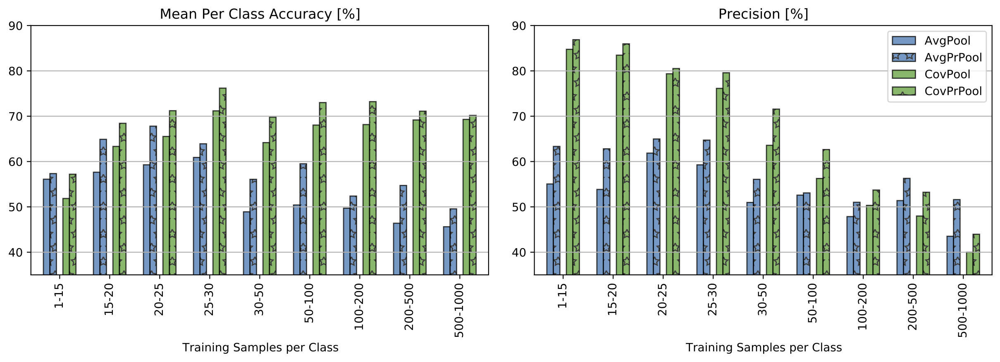

# Fine-grained Species Recognition with Privileged Pooling: Better Sample Efficiency Through Supervised Attention

Official implementation of our TPAMI 2023 [paper (open access)](https://www.computer.org/csdl/journal/tp/5555/01/10255365/1Qzyktqir0A) , [arxiv](https://arxiv.org/abs/2003.09168).

We propose a scheme for supervised image classification that uses privileged information, in the form of keypoint annotations for the training data, to learn strong models from small and/or biased training sets


Predicted classes using privileged pooling on CCT20-Cis test dataset (top) and iBirds2017 test dataset (bottom). Bounding boxes are computed using the predicted attention maps. Attention maps (bounding-box cropped for visualization) depict the encoded privileged information from different keypoints provided at train time. The bottom right-most attention map is not supervised by any keypoint and acts as complementary to other animal regions.

## Datasets


| Dataset  | Training set   | Privileged Information ($x^*$)  | Test set  |
|----      |----------------|------------------------|-----------|
| **CUB200-2011**    | 5,994 training samples from [CUB200-2011](http://www.vision.caltech.edu/datasets/cub_200_2011/) | Keypoint annotations for all training samples from the dataset authors | - 5,794 test samples from CUB200-2011 <br> - **iBirds2017**: Subbest of [iNaturalist2017](https://github.com/visipedia/inat_comp/tree/master/2017) with the test samples from species existing in CUB200-2011. See the iNaturlist2017 - CUB200 taxonomy mapping in `data/classes_taxonomy_CUB.csv`
| **CCT20** | 57,000 training samples from [CameraTrapDataset20](https://beerys.github.io/CaltechCameraTraps/) | **CameraTrapDataset20+**: Keypoint annotations for 1,182 training samples `data/keypoints_cct20plus.csv` | 15,000 Cis and 23,000 Trans test samples from CCT20  
| **iBirds2018** | 143,950 training samples from the *Aves* supercategory from [iNaturalist2018](https://github.com/visipedia/inat_comp/tree/master/2018) | **iBirds2018+**: Keypoint annotations for 1,014 training samples `data/keypoints_inat2018.csv` | 3744 test samples from the *Aves* supercategory |


## Usage

1. Prepare the data:
- Update the function get_basepath to your data folder. it defaults to `/scratch/`.
- Download CUB200-2011 in the corresponding folder
- for keypoint annotations we used the function `annotate_keypoints` scripts in `data/DATASET.py`

2. Install the required packages 

```
pip3 install -r requirements.txt
``````

3. Training

To train a model a first order pooling simply run:
```
python train_img_class.py --dataset=inat2018 --model attention_map

# CUB200 with inat2017 as test set
python train_img_class.py --dataset=birds --model attention_map 

python train_img_class.py --dataset=cct --model attention_map

```
We used an NVIDIA Titan X for all our experiments.

3. Inference

```
python train_img_class.py --test-only --datset inat2018 --model attention_map --resume SAVE_DIR/checkpoint.pth.tar

```


## Method


Privileged Pooling (PrPool) illustration. M attention maps with K supervised and Q complementary ones. $F'$ is the extended feature map obtained using all attention maps (See Eq. 8. from the paper)  $\mathsf{sqrt}(\mathbf{\Sigma}) is the square-root normalized covariance matrix of the expanded feature map $F'$. Green-dotted lines denote quantities used only during training.


## Results


Top-1 accuracy for CUB200 (left) and iBirds2017, (right, CUB species subset of iNaturalist2017) test datasets. Mean accuracy and standard deviation (error bars) over 5 runs. In gray the baselines methods AvgPool and CovPool; green indicates our methods trained with PrPool (ours). Bars with ? indicate use of privileged information at training time (x? methods). LSTM values are taken directly from [53], TransFG-21k uses [54] pretrained on ImageNet-21k and TransFG-1k is pretrained on ImageNet-1k.



Mean per class accuracy and precision for iBirds2018 (Bird species subset of iNaturalist2018). Results are grouped in sub-sets according to the number of available training samples for each class.


## Baselines

- S3N (ICCV, 2019) [code](https://github.com/Yao-DD/S3N)
- WSDAN [code](https://github.com/tau-yihouxiang/WS_DAN)
- h-dropout (CVPR, 2018) [code](https://github.com/johnwlambert/dlupi-heteroscedastic-dropout)
- AtnAction (NeurIPS, 2017) [code](https://github.com/rohitgirdhar/AttentionalPoolingAction)
- iSQRT-COV (CVPR, 2018) [code](https://github.com/jiangtaoxie/fast-MPN-COV)
- LSTM-based (CVPR, 2019) [paper](https://arxiv.org/abs/1903.02827v1) **code not released by the authors**
- TransFG (AAAI 2022) [code](https://github.com/TACJu/TransFG)

