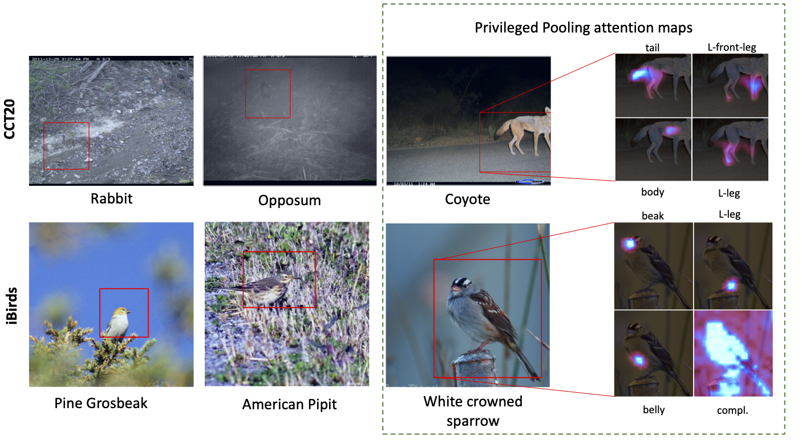
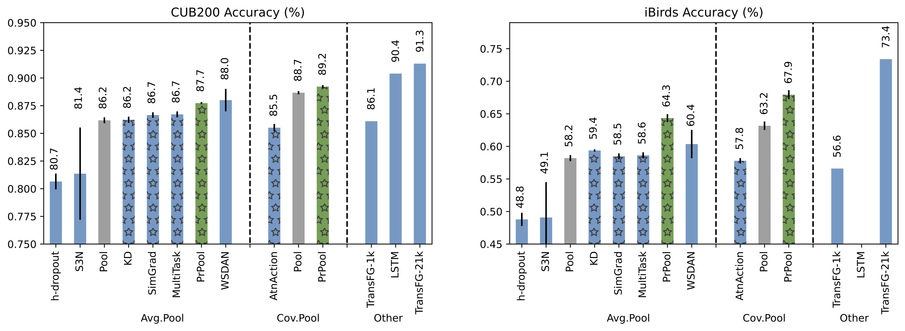

# Privileged Pooling: Better Sample Efficiency Through Supervised Attention

We propose a scheme for supervised image classification that uses privileged information, in the form of keypoint annotations for the training data, to learn strong models from small and/or biased training sets

## Datasets

### Training
- Training split from [CUB200-2011](http://www.vision.caltech.edu/visipedia/CUB-200-2011.html)
- Training split from [CameraTrapDataset 20](https://beerys.github.io/CaltechCameraTraps/)
    - CameraTrapDataset 20+ Keypoint annotations `data/keypoints_cct.csv`

### Test datasets
- Test split from [CUB200-2011]
- *iBirds*: Aves supercategory from [iNaturalist2017](https://github.com/visipedia/inat_comp/tree/master/2017)
    - iNaturalist2017 - CUB200 taxonomy mapping `data/classes_taxonomy_CUB.csv`
    

## Results

